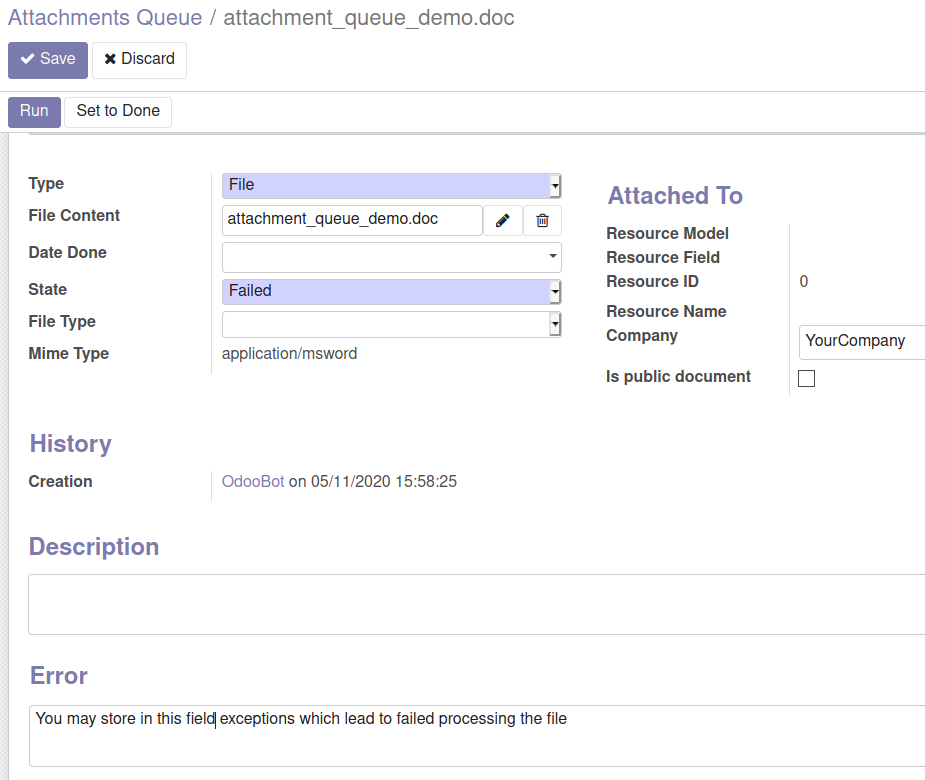

The menu *Settings > Technical > Database Structure > Attachments Queue* displays all the *Attachments Queues* objects.

.. epigraph::
  You can limit the number of attachments processed in the same cron task changing the ``attachment_queue_cron_batch_limit`` value in *Settings > Technical > System parameters > attachment_queue_cron_batch_limit*.

~~~~~~~~~~~~~

To implement a module that creates an action to perform on *Attachments Queues*, you need to :

- add a new **Field Type** to the current selection field.
- override the ``_run()`` method, to perform the action on the *Attachments Queues* with the right *Field Type*.
- and optionally override the ``_get_failure_emails()`` method, to fill the *Failure Emails* field and send a notification to these emails if the ``_run()`` method fails for a specific attachment.
