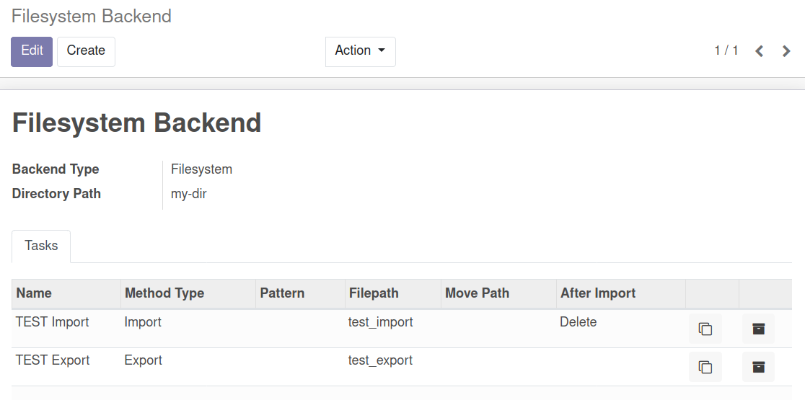
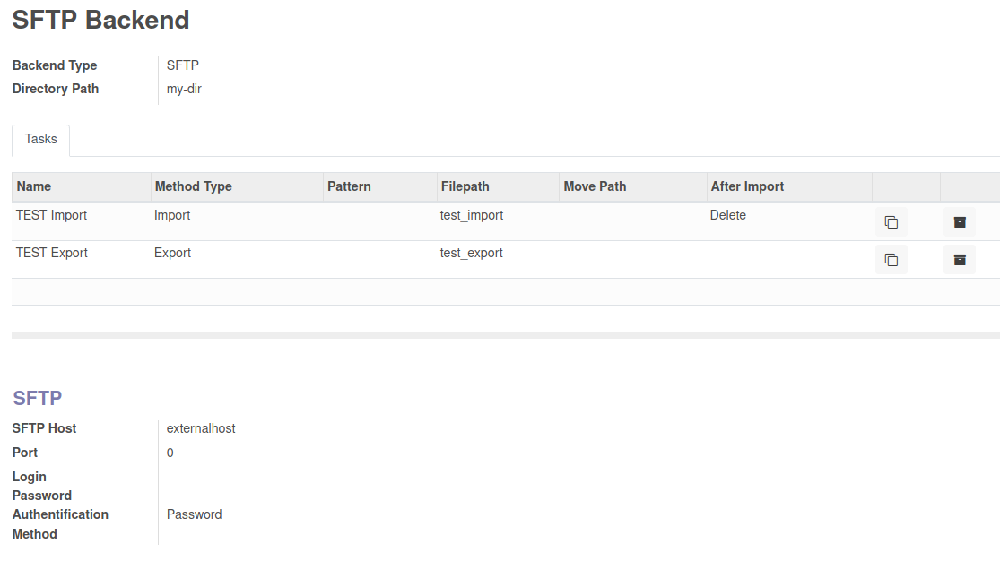

To use this module, you need to:

* Add a location with your server infos
* Create a task with your file info and remote communication method
* A cron task will trigger each task

With the help of storage_backend_sftp