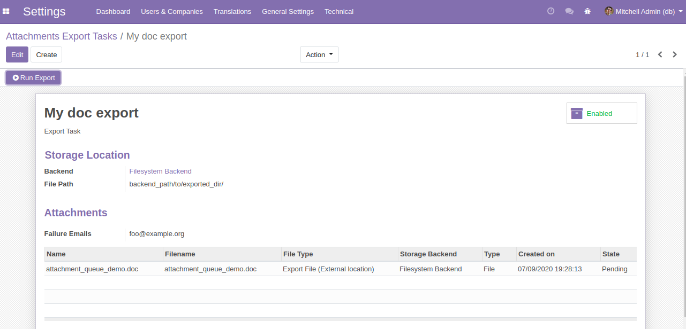

As importation and exportation are different processes, they are triggered in different ways :

**To import files**, you need to create an *"Attachment Import Task"* (menu *Settings > Technical > Attachments Import Tasks*) which defines :

- where to find the files to import from the backend server (path to the files, selection pattern)
- what to do with the source files in the backend server (avoid duplicates, delete/rename after import...)
- how the files will be processed once imported (through the **File Type** field).

.. epigraph::

  🔎 The **File Type** options are defined by other modules built to process the Attachments Queues with the same "File Type".

**To export files**, you need first to register them as *"Attachments Queues"* objects linked to an *"Attachment Export Task"* (which set automatically their **File Type** to *"Export File (External Location)"*).

Then, you can export one file at a time from the *Attachment Queue*'s form view, or export all the *Attachments Queues* in a pending state related to the same *Export Task* from the given *Export Task* form view (menu *Settings > Technical > Attachments Export Tasks*) :

