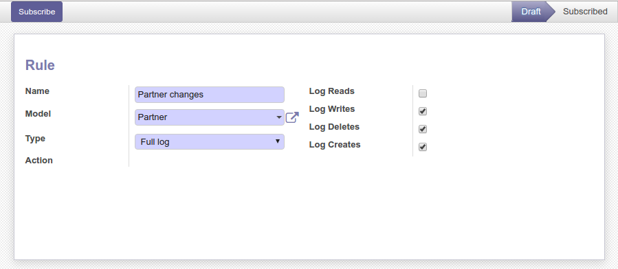

Rules
~~~~~

Go to `Settings / Technical / Audit / Rules` to subscribe rules. A rule defines
which operations to log for a given data model.

Cleanup
~~~~~~~

A scheduled action exists to delete logs older than 6 months (180 days)
automatically but is not enabled by default.
To activate it and/or change the delay, go to the
`Configuration / Technical / Automation / Scheduled Actions` menu and edit the
`Auto-vacuum audit logs` entry:

.. image:: ../static/description/autovacuum.png

In case you're having trouble with the amount of records to delete per run,
you can pass the amount of records to delete for one model per run as the second
parameter, the default is to delete all records in one go.

Security / Policy
~~~~~~~~~~~~~~~~~

You need to be aware that logging can contain sensitive data. With raw HTTP logs,
there not much to do about that, but for ORM logging, the module blacklists all
fields called `password`. If you really need to audit that (having plain passwords
laying around is a policy violation basically everywhere), rename your field or
create a related field used for input.
