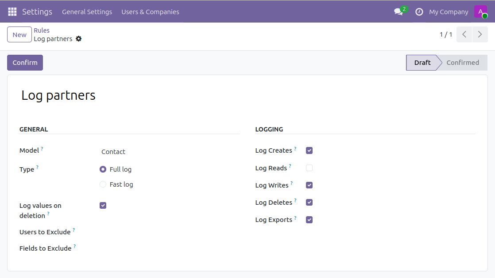
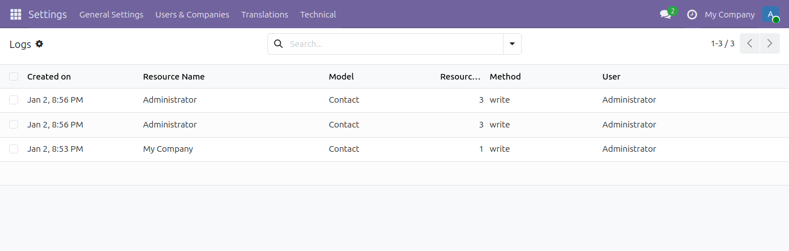
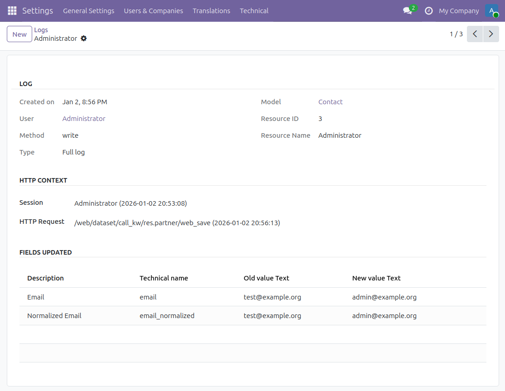
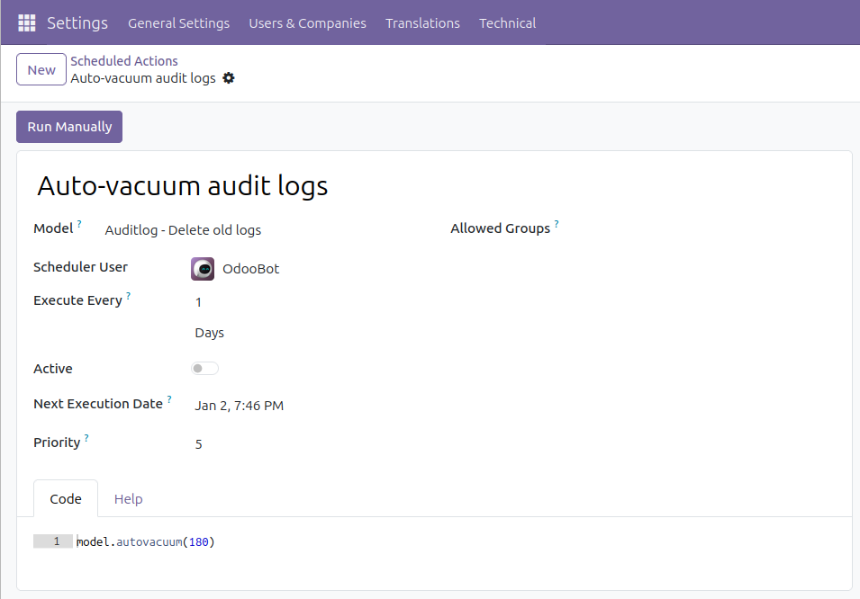

Go to Settings / Technical / Audit / Rules to subscribe rules. A rule
defines which operations to log for a given data model.

Then, check logs in the Settings / Technical / Audit / Logs menu. You
can group them by user sessions, date, data model or HTTP requests:

Get the details:

Reads are logged when they go through the `read` or `search_read`
methods. This covers the reads of the web client (`web_read` and
`web_search_read` call `read`), of RPC calls and of server code. Field
values accessed directly on records, reports and `read_group` are not
logged.

By default, a read log stores the value of every field read. Uncheck
*Log Read Values* on the rule to store only the names of the fields read,
in the *Fields Read* field of the log. It keeps read logs much smaller,
and it keeps sensitive values out of the logs: users who can open the
logs of a record would otherwise see the values of fields they are not
allowed to read on the record itself.

Read logs without values have no lines, so they are not listed in the
*Log Lines* menu.

A scheduled action exists to delete logs older than 6 months (180 days)
automatically but is not enabled by default. To activate it and/or
change the delay, go to the Configuration / Technical / Automation /
Scheduled Actions menu and edit the Auto-vacuum audit logs entry:

In case you're having trouble with the amount of records to delete per
run, you can pass the amount of records to delete for one model per run
as the second parameter, the default is to delete all records in one go.

There are two possible groups configured to which one may belong. The
first is the Auditlog User group. This group has read-only access to the
auditlogs of individual records through the View Logs action. The second
group is the Auditlog Manager group. This group additionally has the
right to configure the auditlog configuration rules.
