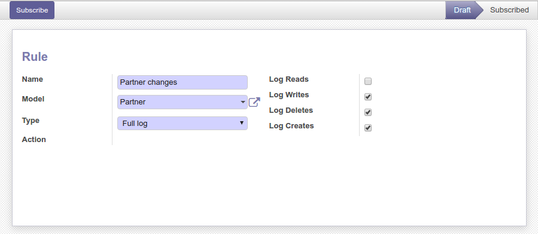
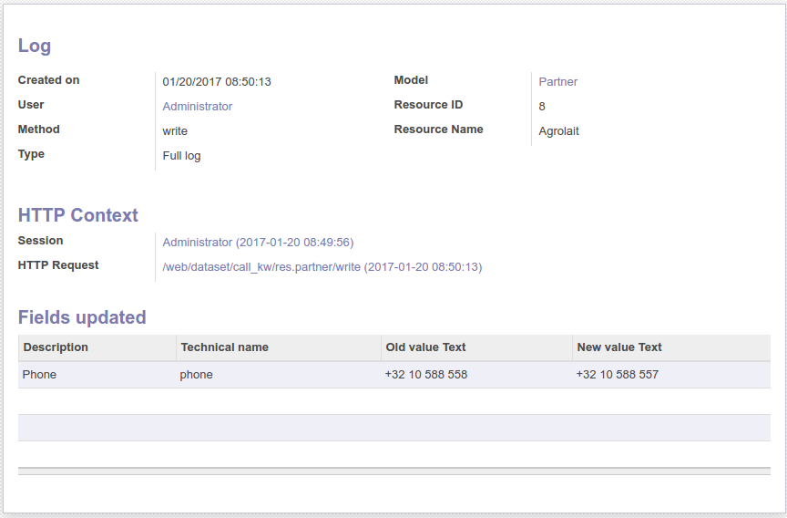
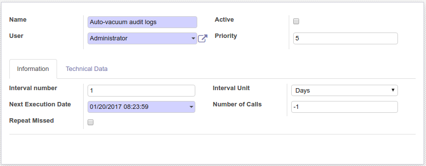

Go to Settings / Technical / Audit / Rules to subscribe rules. A rule
defines which operations to log for a given data model.

Then, check logs in the Settings / Technical / Audit / Logs menu. You
can group them by user sessions, date, data model or HTTP requests:

Get the details:

A scheduled action exists to delete logs older than 6 months (180 days)
automatically but is not enabled by default. To activate it and/or
change the delay, go to the Configuration / Technical / Automation /
Scheduled Actions menu and edit the Auto-vacuum audit logs entry:

In case you're having trouble with the amount of records to delete per
run, you can pass the amount of records to delete for one model per run
as the second parameter, the default is to delete all records in one go.

There are two possible groups configured to which one may belong. The
first is the Auditlog User group. This group has read-only access to the
auditlogs of individual records through the View Logs action. The second
group is the Auditlog Manager group. This group additionally has the
right to configure the auditlog configuration rules.
