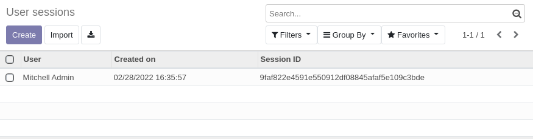
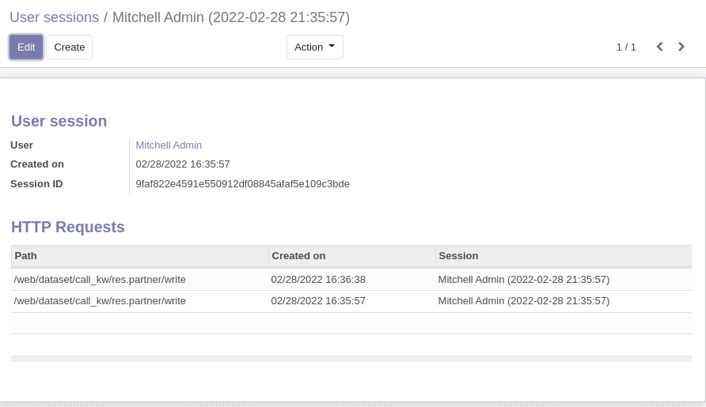
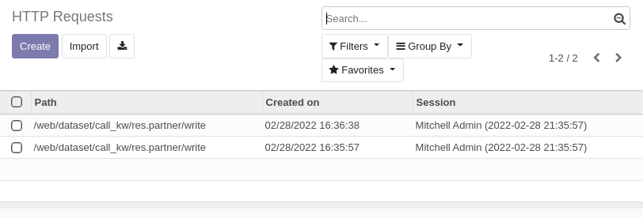
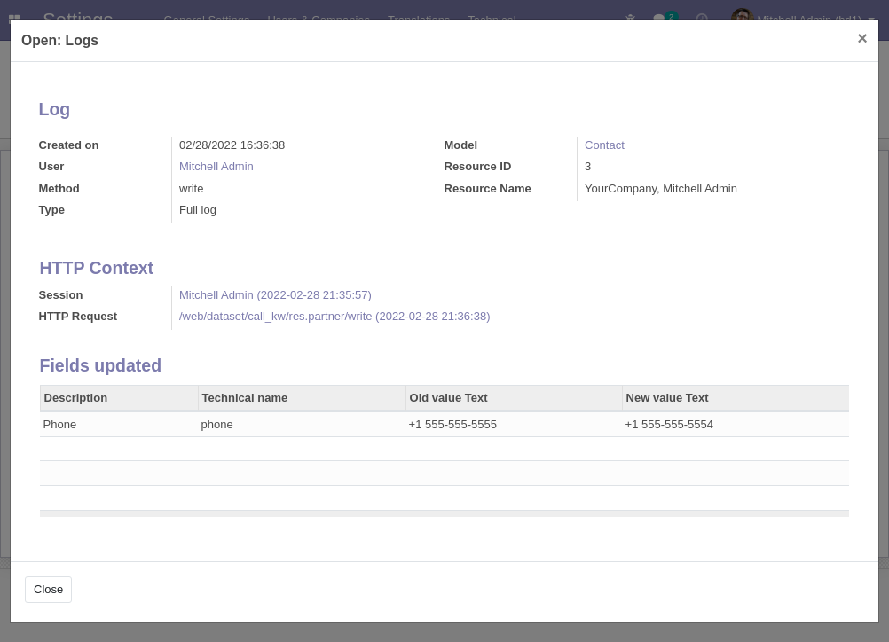
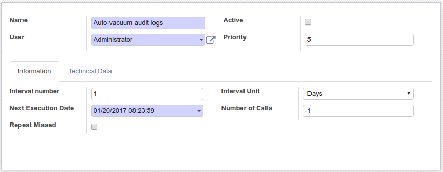

Go to `Settings / Technical / Audit / Rules` to subscribe rules. A rule defines
which operations to log for a given data model.

.. image:: ../static/description/rule.png

Then, check logs in the `Settings / Technical / Audit / Logs` menu. You can
group them by user sessions, date, data model or HTTP requests:

.. image:: ../static/description/logs.png

Get the details:

.. image:: ../static/description/log.png

Check the User Sessions in the `Settings / Technical / Audit / User Sessions` menu.

Get the User session details:

Check the HTTP requests in the `Settings / Technical / Audit / HTTP requests` menu.

Get the HTTP request details:

A scheduled action exists to delete logs older than 6 months (180 days)
automatically but is not enabled by default.
To activate it and/or change the delay, go to the
`Configuration / Technical / Automation / Scheduled Actions` menu and edit the
`Auto-vacuum audit logs` entry:

