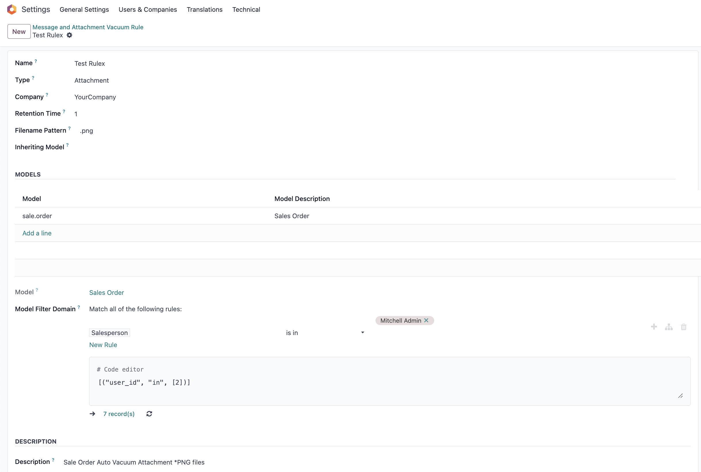
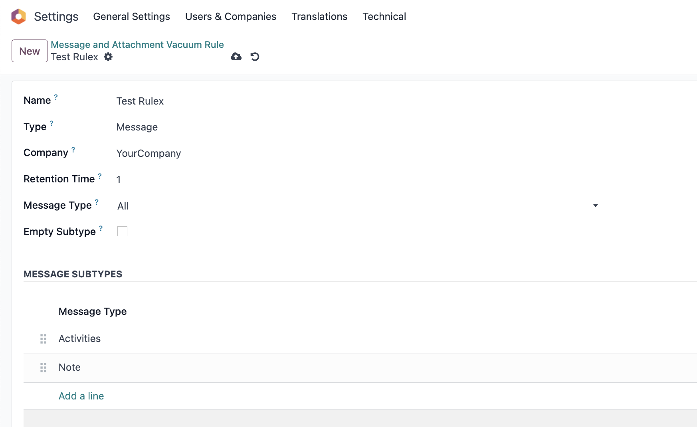
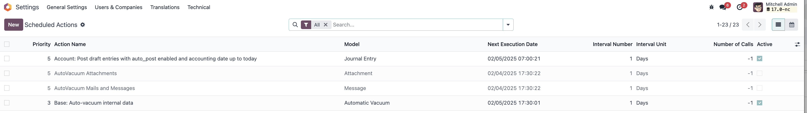
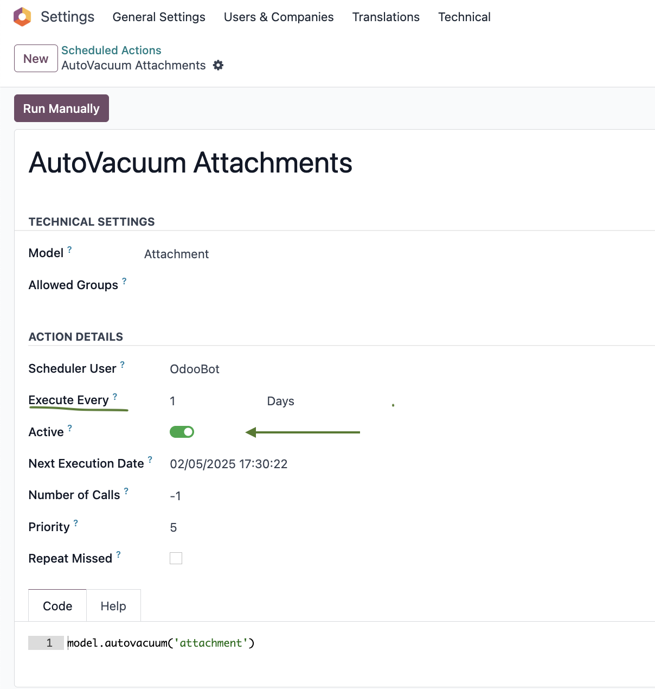

## To Create AutoVacuum Rules

Go to Settings -\> Technical -\> Email -\> Message And Attachment Vacuum Rules
- Press the "New" button to add a new rule

## To Configure the Attachment AutoVacuum Rule
- **Name:** Set the name of the rule
- **Type:** Select type "Attachment"
- **Company:** Select a Company
- **Retention Time:** Set Retention Time in days
- **Filename Pattern:** Set file name pattern (for example ".png")
- **Inherited Model:** Set the Inherited Model (optional)
- **Model:** Select the Model to apply the rule to
- **Model Filter Domain:** Specify the domain for the model to select particular records only
- **Description:** Add a description for the rule set (optional)

## To Configure the Message AutoVacuum Rule
- **Name:** Set the name of the rule
- **Type:** Select type "Message"
- **Company:** Select a Company
- **Retention Time:** Set Retention Time in days
- **Message Type:** Select the Message Type to apply the rule to:
    - **All:** Apply to all messages
    - **Comment:** Apply to comments
    - **System Notification:** Apply to system notifications
    - **User Specific Notification:** Apply to user specific notifications
- **Empty Subtype:** Apply to messages with no subtype
- **Message Subtype:** Press the "Add line" button and select the Chatter Message Subtype to apply the rule to
- **Model:** Select the Model to apply the rule to
- **Message Filter Domain:** Specify the domain for the model to select particular records only
- **Description:** Add a description for the rule set (optional)

## To Configure AutoVacuum Cron Jobs

Note: The AutoVacuum Mails and Messages and AutoVacuum Attachments scheduled actions are created by default and need to be activated.

Go to Settings -\> Technical -\> Automation -\> Scheduled Actions
- Activate the scheduled actions needed (AutoVacuum Mails and Messages and/or AutoVacuum Attachments)
- Go to Actions -> Unarchive or toggle the Active status of the scheduled action
- Select a record and specify the frequency of the cron job if needed

Note: It is recommended to run it frequently and when the system is not very loaded. (For instance: once a day, during the night.)
