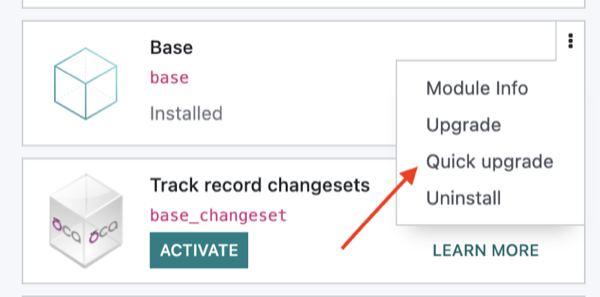

1. Install the `base_module_quick_update` module.
2. Open **Apps** and the card of the desired installed module.
3. Click **Quick upgrade** (on the form view and/or on the kanban / module
   action menu).
 
4. Wait for the upgrade to apply to the selected module only (without
   mass-upgrading dependents).

For comparison: the regular **Upgrade** button still upgrades the module
together with the installed modules that depend on it.
