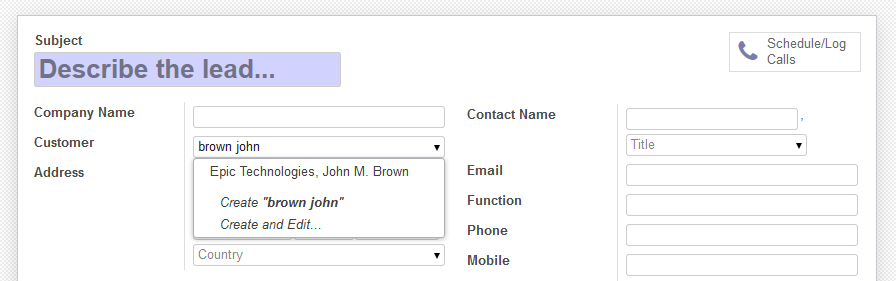
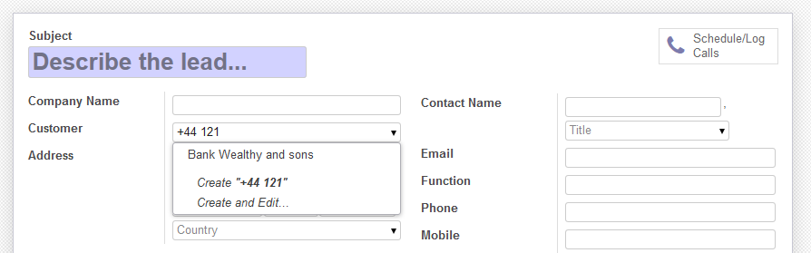

.. image:: https://img.shields.io/badge/licence-AGPL--3-blue.svg
   :target: http://www.gnu.org/licenses/agpl-3.0-standalone.html
   :alt: License: AGPL-3

====================
Improved Name Search
====================

Extends the name search feature to use additional, more relaxed
matching methods, and to allow searching into configurable additional
record fields.

The name search is the lookup feature to select a related record.
For example, selecting a Customer on a new Sales order.

For example, typing "john brown" doesn't match "John M. Brown".
The relaxed search also looks up for records containing all the words,
so "John M. Brown" would be a match.
It also tolerates words in a different order, so searching
for "brown john" also works.

Additionally, an Administrator can configure other fields to also lookup into.
For example, Customers could be additionally searched by City or Phone number.

How it works:

Regular name search is performed, and the additional search logic is only
triggered if not enough results are found.
This way, no overhead is added on searches that would normally yield results.

But if not enough results are found, then additional search methods are tried.
The specific methods used are:

- Try regular search on each of the additional fields
- Try ordered word search on each of the search fields
- Try unordered word search on each of the search fields

All results found are presented in that order,
hopefully presenting them in order of relevance.

Installation
============

No specific requirements.

Configuration
=============

The fuzzy search is automatically enabled on all Models.
Note that this only affects typing in related fields.
The regular ``search()``, used in the top right search box, is not affected.

Additional search fields can be configured at Settings > Technical > Database > Models,
using the "Name Search Fields" field.

.. image:: images/image1.png

Usage
=====

Just type into any related field, such as Customer on a Sale Order.

.. image:: https://odoo-community.org/website/image/ir.attachment/5784_f2813bd/datas
   :alt: Try me on Runbot
   :target: https://runbot.odoo-community.org/runbot/149/9.0

.. repo_id is available in https://github.com/OCA/maintainer-tools/blob/master/tools/repos_with_ids.txt
.. branch is "8.0" for example

Known issues / Roadmap
======================

* Also use fuzzy search, such as the Levenshtein distance:
  https://www.postgresql.org/docs/9.5/static/fuzzystrmatch.html
* The list of additional fields to search could benefit from caching, for efficiency.
* This feature could also be implemented for regular ``search`` on the ``name`` field.

Bug Tracker
===========

Bugs are tracked on `GitHub Issues
<https://github.com/OCA/server-tools/issues>`_. In case of trouble, please
check there if your issue has already been reported. If you spotted it first,
help us smashing it by providing a detailed and welcomed feedback.

Credits
=======

Images
------

* Odoo Community Association: `Icon <https://github.com/OCA/maintainer-tools/blob/master/template/module/static/description/icon.svg>`_.

Contributors
------------

* Daniel Reis <https://github.com/dreispt>

Maintainer
----------

.. image:: https://odoo-community.org/logo.png
   :alt: Odoo Community Association
   :target: https://odoo-community.org

This module is maintained by the OCA.

OCA, or the Odoo Community Association, is a nonprofit organization whose
mission is to support the collaborative development of Odoo features and
promote its widespread use.

To contribute to this module, please visit https://odoo-community.org.
