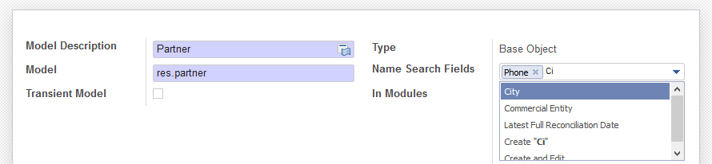

Go to Settings > Smart Searches
Remove default filter to see all Models
Choose the Modlel you want to configure and choose your options (Smart Search,
Smart Name Search, Domain, Smart Search fields)

In the example, we choose to activate improved search for Contacts (partners) and
Products. Furthermore user can search a contact typing their city name

