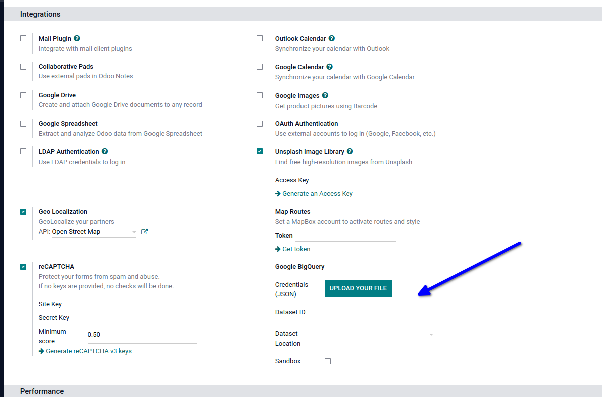

**Configure the integration**:

#. Go to BigQuery in the menu
#. Setup a service account at Google (https://console.cloud.google.com/iam-admin/serviceaccounts)
#. Upload the credentials (JSON formatted) in **Settings > General Settings > Integrations** and choose a Dataset ID
   (e.g. `odoo_dataset`)

**Configure which models you want to load into BigQuery**:

#. Go to the BigQuery app
#. Click Create and select a model
#. Click Save
#. Configure which fields you want to load into BigQuery
#. Enable the configuration by ticking 'Enabled'
