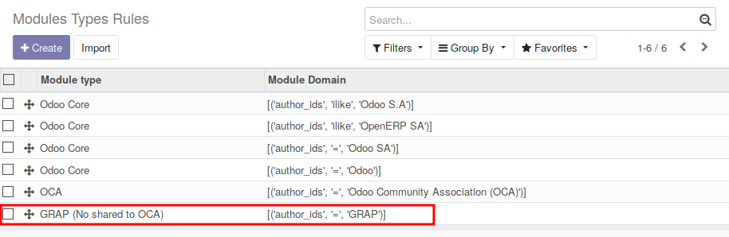
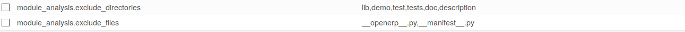

- Go to Apps / Module Analysis / Modules Types Rules

The Module types Rules are usefull to get the Type of a module, based on
it information.

This module comes with default rules.

> 

You can add your custom rules to identify the modules your team have
developped for exemple,

> 

to update the data manually, you have to :

- Go to 'Settings' / 'Technical' / 'Scheduled Actions'
- Run manually the action : 'Update Module Analysis'

This will update analysis of your installed modules.

to update the data automatically, you have to :

- Go to 'Settings' / 'Technical' / 'Scheduled Actions'
- Configure the action 'Update Module Analysis' and activate it. (By
  default, the cron is unactive and no analysis is done)

## Adding Extra data

If you want to analyse other data, (for exemple, having the number of
HTML files), create a custom modules and overload the module model :

``` python
from odoo import api, fields, models

class IrModuleModule(models.Model):
   _inherit = 'ir.module.module'

   xml_documentation_qty = fields.Integer(
      string='Quantity of Comments in XML Files')

  @api.model
  def _get_analyse_settings(self):
      res = super()._get_analyse_settings()
      if not '.html' in res:
          res['.html'] = {}
      res['.html']['documentation'] 'xml_documentation_qty'
      return res
```

## Exclude files and directories

Two parameters are availaible in 'Settings' / 'Technical' / 'Parameters'
'System Parameters' :

> 

The list of folders and filename will be exclude from the analysis. You
can change the default settings.
