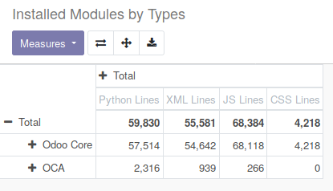
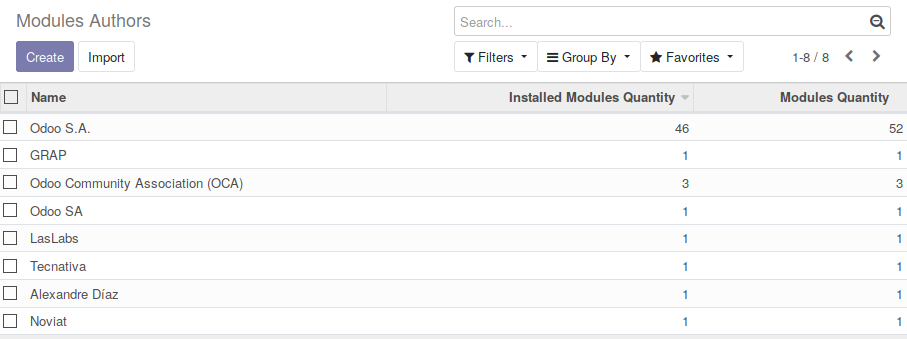
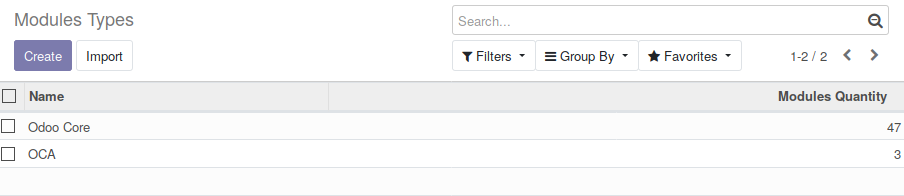

This module allows you to know 'how much code' is running on your Odoo
instance, group by 'Type' (Odoo Core, OCA, other...)

This module can be usefull in the following cases :

* To analyse the size of your technical debt, regarding your Custom modules
* To know the ratio between Odoo / OCA and Custom modules
* To evaluate the amount to pay to odoo to upgrade your custom code, or the
  induced workload

For that purpose, it adds new concepts

* ``ir.module.author``, based on the value ``author`` present in the manifest
  file.

* ``ir.module.type``, populated by default with Odoo and OCA values.

Each installed modules have extra data in the 'Technical Data' tab :

.. image:: ../static/description/module_form.png
