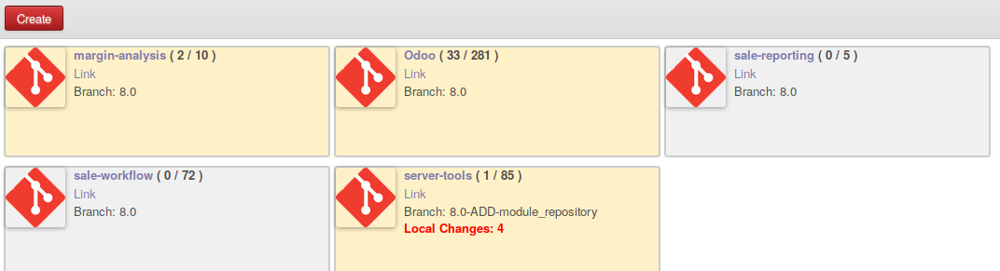
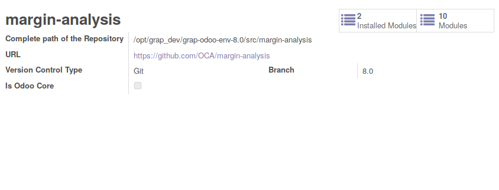

To update all repositories informations

* Go to 'Settings' / 'Update Module List' / 'Apply'

* this process could take a while.

* Go to 'Settings' / 'Repositories'

* Click on a repository to diplay detail

The following information are available

* Name of the folder of the repository
* URL and name of the current Branch
* Number of files with unstaged / uncommitted modifications
* Number of installed modules and total modules available
