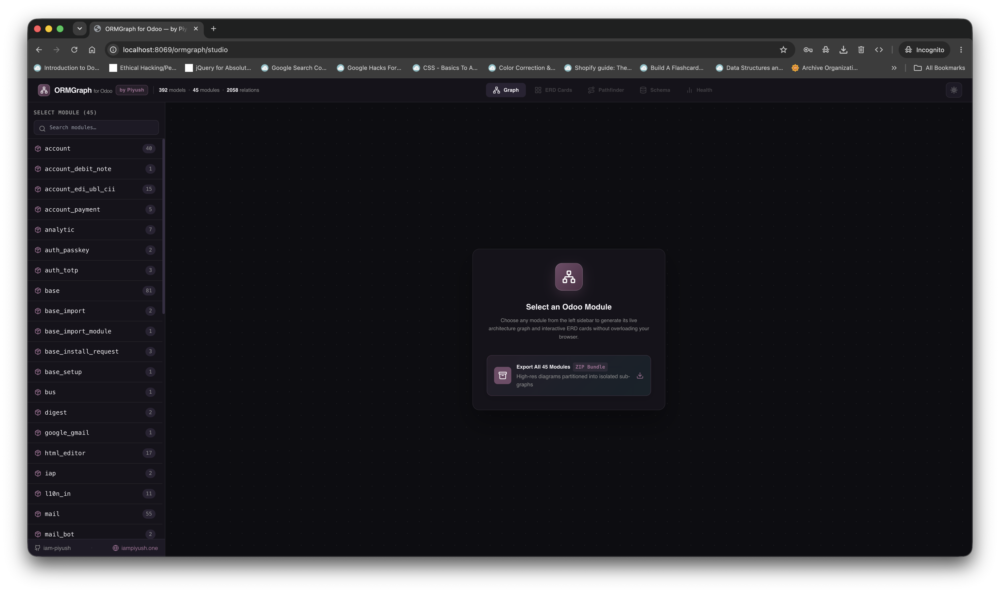
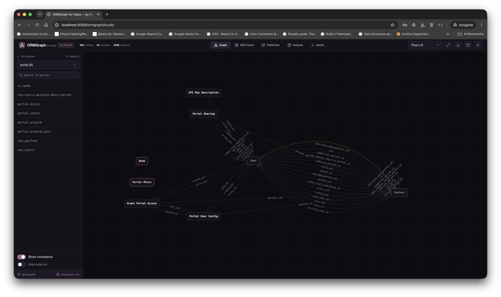
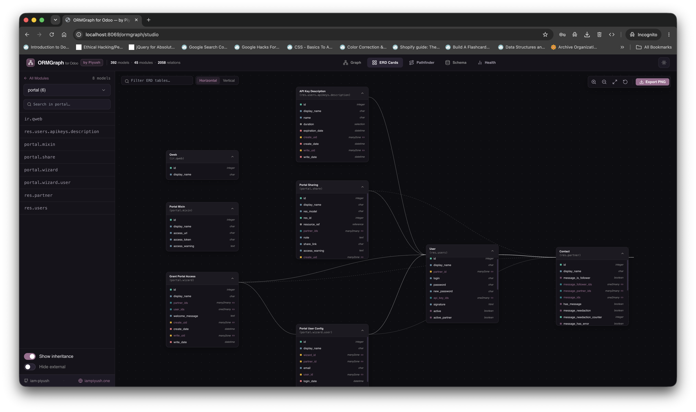
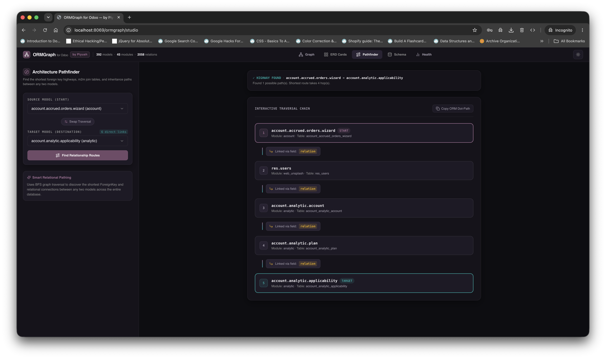
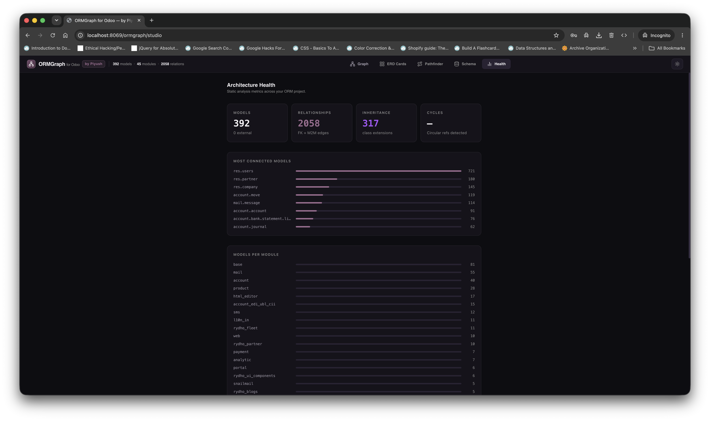
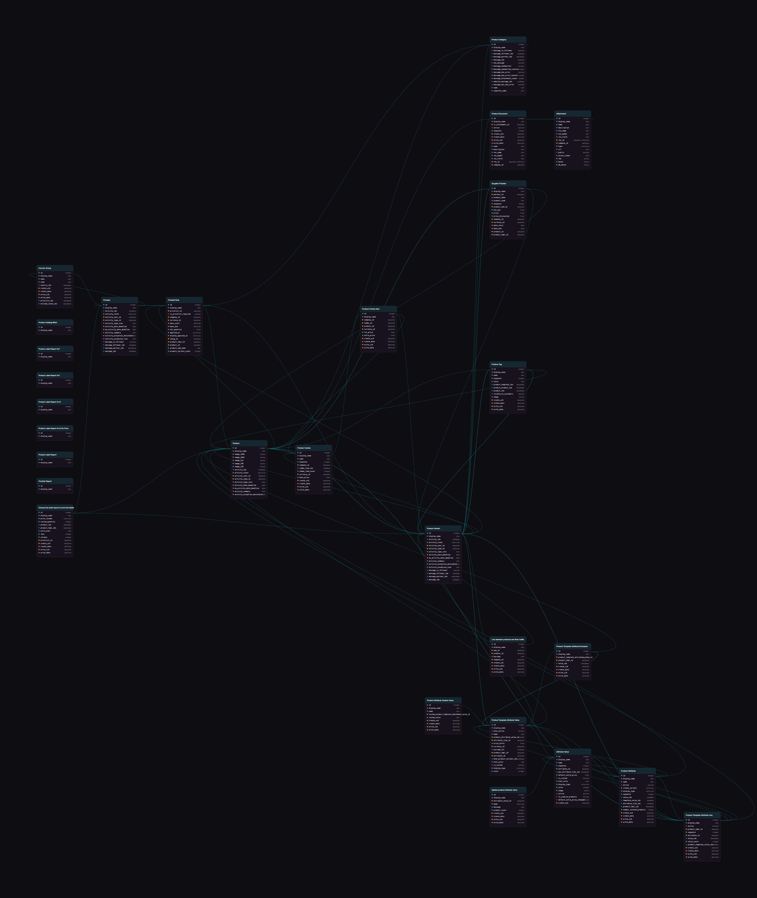

# ORMGraph for Odoo

> Live Architecture Explorer, Visual ERD Studio, and Relational Pathfinder for Odoo & Python ORMs.

[](https://www.gnu.org/licenses/lgpl-3.0)
[](https://www.python.org/)
[](https://www.odoo.com/)
[](https://iampiyush.one)

---

## Why I Built This

If you’ve ever worked on a mid-to-large Odoo project, you know the frustration:
- A standard database quickly exceeds **400+ to 800+ models**.
- Relational fields (`Many2one`, `One2many`, `Many2many`, `_inherits`) are scattered across dozens of core and third-party modules.
- Dumping the whole database into a generic schema visualizer either crashes the browser tab or produces an unreadable web of lines.
- Figuring out how to write a computed field dependency or tracing how `account.move` links to a custom model usually means grepping through thousands of lines of Python code.

**ORMGraph** was built to solve this. It gives developers a clean, zero-lag visual studio to inspect models module-by-module, trace relational paths, view table-level ERDs, and export high-resolution diagrams.

---

## Visual Tour

### 1. Studio Workspace (Zero-Lag Architecture)
Opens with a clean slate. You can search or pick any installed module from the sidebar without freezing your browser.



---

### 2. Module Architecture Graph
Select a module (like `sale`, `fleet`, or `account`) to immediately render its model topology, foreign connections, and inheritance hierarchies.



---

### 3. Interactive ERD Schema Cards
Explore table cards complete with field names, data types, and color-coded relational tags (`Many2one`, `One2many`, `Computed`, `Selection`).



---

### 4. BFS Relational Pathfinder
Pick any two models in your database to find the shortest relational route between them. It outputs the exact Python ORM dot-path (`partner_id.currency_id.symbol`) so you can copy and paste directly into your code.



---

### 5. Architecture Health & Circular Dependency Diagnostics
A dedicated diagnostic dashboard that flags circular relationships, identifies isolated models, and calculates degree centrality across your database.



---

### 6. High-Resolution ERD Table Card Export
Export clean, presentation-ready PNG diagrams of your database tables or automatically partition large modules into clustered ZIP bundles.



---

### 7. High-Resolution Architecture Graph Export
Download full-vector Cytoscape graph diagrams with automatic watermarking, perfect for technical documentation and sprint planning.


---

## Key Features

* **Module-by-Module Isolation**: Only loads the models for the module you select, keeping rendering snappy and readable.
* **Interactive ERD Table Cards**: Color-coded badges for relational, numeric, boolean, computed, and selection fields.
* **Multi-Hop Relational Pathfinder**: Computes the shortest foreign key path between any two models using Breadth-First Search (BFS).
* **Smart ZIP Exporter**: Automatically detects large modules (>20 models) and partitions them into Hub sub-clusters with a table of contents manifest.
* **Odoo Smart Button**: Adds a direct "Architecture Visualizer" button inside `Settings ➔ Technical ➔ Database Structure ➔ Models`.
* **Static AST Code Intelligence**: Can also run purely from the terminal via Python AST without requiring a live PostgreSQL database.

---

## Installation & Setup

### Option 1: Install as an Odoo Addon (Recommended)

1. Copy the `ormgraph_odoo` folder into your Odoo addons directory:
   ```bash
   cp -r ormgraph_odoo /path/to/your/odoo/custom_addons/
   ```

2. Restart your Odoo server and enable developer mode:
   - Navigate to **Apps ➔ Update Apps List**
   - Search for **ORMGraph**
   - Click **Install**

3. Open **ORMGraph Studio** directly from the Odoo main apps menu, or click the **Architecture Visualizer** smart button on any model form in `Technical ➔ Models`.

---

### Option 2: Standalone Python CLI

You can also use ORMGraph as a standalone tool to analyze any Python project (Odoo, Django, or SQLAlchemy) statically via AST:

```bash
# Clone the repository
git clone https://github.com/iam-piyush/ormgraph.git
cd ormgraph

# Install locally
pip install -e .

# Scan an Odoo codebase
ormgraph scan /path/to/odoo/custom_addons --output graph.json

# Launch the interactive local studio
ormgraph studio /path/to/odoo/custom_addons
```

---

## Technical Stack

- **Backend**: Python 3.10+, Odoo HTTP Controllers, AST Static Analyzer, NetworkX Graph Algorithms.
- **Frontend Studio**: Next.js 14, React 18, Cytoscape.js (Dagre, Cose, Concentric), Tailwind CSS, Framer Motion.
- **Export Engine**: HTML5 Canvas, JSZip, Blob API.

---

## Author & Credits

Created and maintained by **Piyush Kumar** — Full-Stack Software Engineer & Odoo Specialist.

- **Portfolio**: [https://iampiyush.one](https://iampiyush.one)
- **GitHub**: [@iam-piyush](https://github.com/iam-piyush)
- **Twitter / X**: [@ipiyuush](https://x.com/ipiyuush)
- **LinkedIn**: [Piyush Kumar](https://linkedin.com/in/iam-piyush)

---

## License

This project is licensed under the **GNU Lesser General Public License v3.0 (LGPL-3.0)** — see the [LICENSE](LICENSE) file for details.
