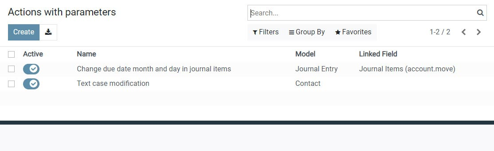
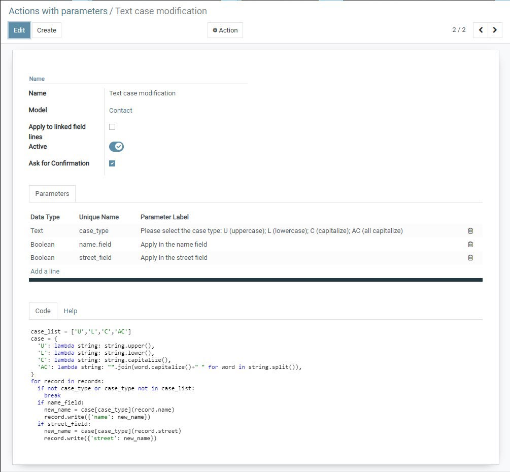
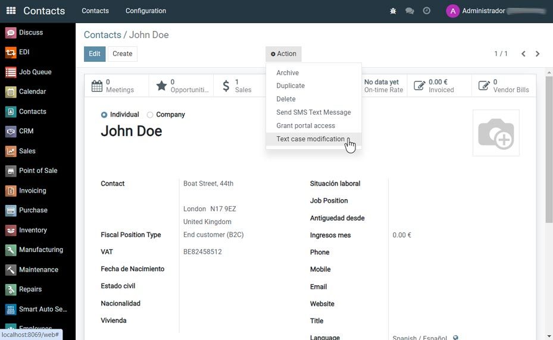
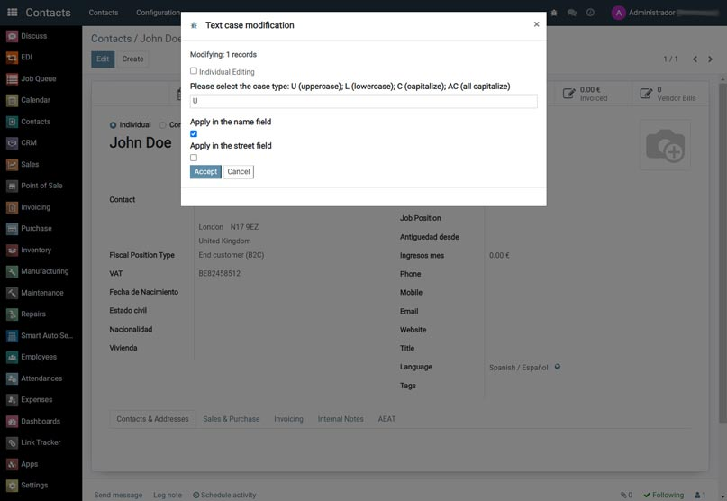
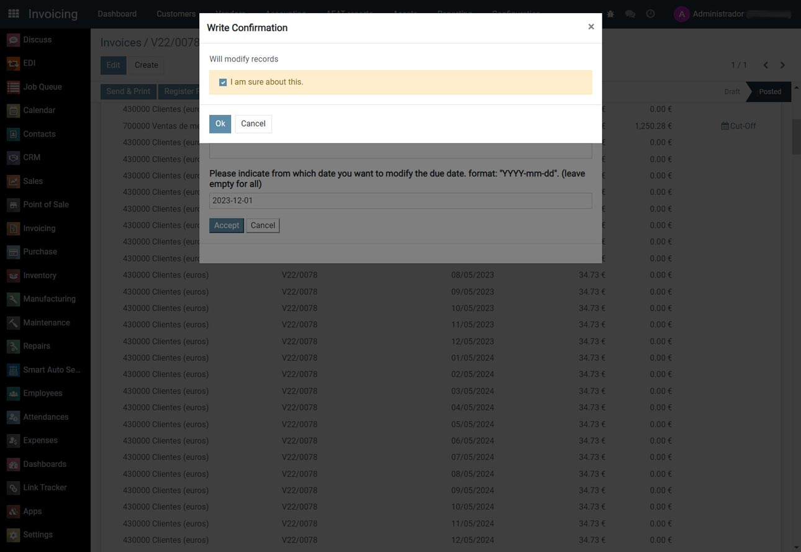
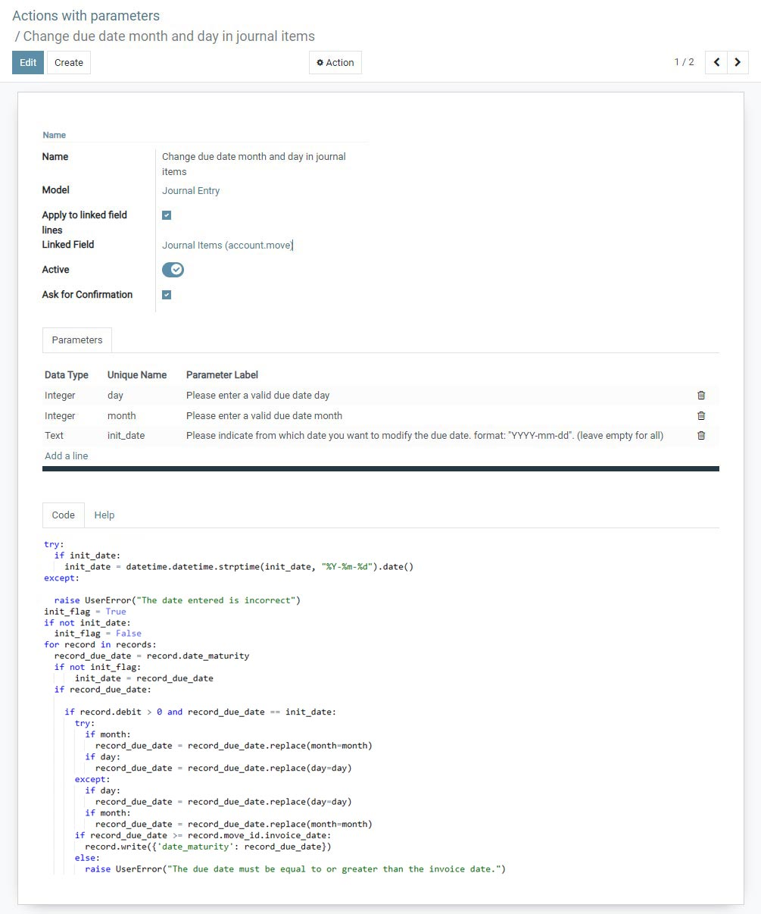
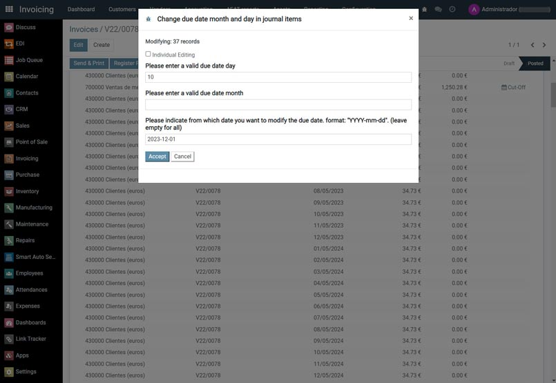

=======================
Server Action Input Box
=======================

.. 
   !!!!!!!!!!!!!!!!!!!!!!!!!!!!!!!!!!!!!!!!!!!!!!!!!!!!
   !! This file is generated by oca-gen-addon-readme !!
   !! changes will be overwritten.                   !!
   !!!!!!!!!!!!!!!!!!!!!!!!!!!!!!!!!!!!!!!!!!!!!!!!!!!!
   !! source digest: sha256:751a27953639a58662712a490f6dca08a4f327796da6b3accb5982f2ad06f823
   !!!!!!!!!!!!!!!!!!!!!!!!!!!!!!!!!!!!!!!!!!!!!!!!!!!!

.. |badge1| image:: https://img.shields.io/badge/maturity-Beta-yellow.png
    :target: https://odoo-community.org/page/development-status
    :alt: Beta
.. |badge2| image:: https://img.shields.io/badge/licence-AGPL--3-blue.png
    :target: http://www.gnu.org/licenses/agpl-3.0-standalone.html
    :alt: License: AGPL-3
.. |badge3| image:: https://img.shields.io/badge/github-OCA%2Fserver--tools-lightgray.png?logo=github
    :target: https://github.com/OCA/server-tools/tree/17.0/server_action_input_box
    :alt: OCA/server-tools
.. |badge4| image:: https://img.shields.io/badge/weblate-Translate%20me-F47D42.png
    :target: https://translation.odoo-community.org/projects/server-tools-17-0/server-tools-17-0-server_action_input_box
    :alt: Translate me on Weblate
.. |badge5| image:: https://img.shields.io/badge/runboat-Try%20me-875A7B.png
    :target: https://runboat.odoo-community.org/builds?repo=OCA/server-tools&target_branch=17.0
    :alt: Try me on Runboat

|badge1| |badge2| |badge3| |badge4| |badge5|

Description
-----------

Server actions provide us with the capability to perform operations on
records of a model, both individually and in bulk. In certain cases, it
is necessary to adjust specific parameters of these actions based on
circumstances. Through the incorporation of an input box provided by
this module, we have the flexibility to specify these parameters on the
fly, without the need to directly modify the server action.

Although all code configuration is done through this module, its
execution takes place within a server action, ensuring the security and
reliability inherent in the Odoo environment.

Key Features
============

- **Perfect Integration:** The application seamlessly integrates with
  Odoo Server Actions. You can access it by clicking on "Actions with
  Parameters" through the "Technical" menu in the Actions section.

- **User-Friendly Interface:** Users can configure the target model
  where the action will be performed, the parameters to be requested
  from the input box, and the Python code of the action using the
  environment variables specific to Server Actions and the variables
  associated with user-created parameters in this application.

- **Flexible Configuration:** The module allows users to specify as many
  parameters as needed. They can choose a "one2many" field of the target
  model as the set of records on which the action will be performed.
  Users can select whether the action will be performed in bulk (the
  same parameter value for all) or individually (configure the parameter
  value one by one for each record).

- **Security:** While all code configuration is done through this
  module, its execution takes place within a Server Action, ensuring the
  inherent security and reliability of the Odoo environment. Optionally,
  it includes a confirmation box to appear at the moment of executing
  the action, providing the opportunity to cancel at the last moment.

**Table of contents**

.. contents::
   :local:

Installation
============

1. Clone the module from
   `OCA/server-tools <https://github.com/OCA/server-tools/tree/17.0/server_action_input_box>`__
2. Install the module in your Odoo instance.
3. Configure module settings according to your business requirements.

Usage
=====

Access the application from the menu: Technical > Actions > Actions with parameters.

Example of action to change the text case.

Access the action from the model menu.

View of the configured action input box.

Optionally you can activate write confirmation. Check on "Ask for Confirmation" field.

Check on "Apply to linked field lines" field to apply to records from an on2many field (ex.: Journal Items).

View of the configured action input box.

   
Bug Tracker
===========

Bugs are tracked on `GitHub Issues <https://github.com/OCA/server-tools/issues>`_.
In case of trouble, please check there if your issue has already been reported.
If you spotted it first, help us to smash it by providing a detailed and welcomed
`feedback <https://github.com/OCA/server-tools/issues/new?body=module:%20server_action_input_box%0Aversion:%2017.0%0A%0A**Steps%20to%20reproduce**%0A-%20...%0A%0A**Current%20behavior**%0A%0A**Expected%20behavior**>`_.

Do not contact contributors directly about support or help with technical issues.

Credits
=======

Authors
-------

* Jesús Sánchez - jesanmor

Contributors
------------

- Jesús Sánchez <jesanmor.dev@gmail.com>

Maintainers
-----------

This module is maintained by the OCA.

.. image:: https://odoo-community.org/logo.png
   :alt: Odoo Community Association
   :target: https://odoo-community.org

OCA, or the Odoo Community Association, is a nonprofit organization whose
mission is to support the collaborative development of Odoo features and
promote its widespread use.

.. |maintainer-jesanmor| image:: https://github.com/jesanmor.png?size=40px
    :target: https://github.com/jesanmor
    :alt: jesanmor

Current `maintainer <https://odoo-community.org/page/maintainer-role>`__:

|maintainer-jesanmor| 

This module is part of the `OCA/server-tools <https://github.com/OCA/server-tools/tree/17.0/server_action_input_box>`_ project on GitHub.

You are welcome to contribute. To learn how please visit https://odoo-community.org/page/Contribute.
