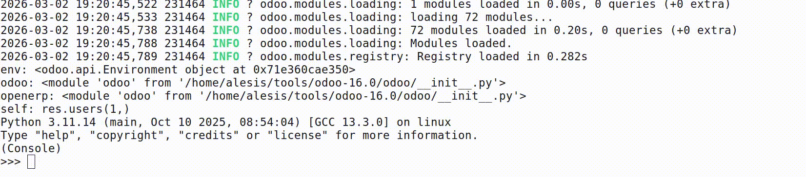

========================
Shell Model Autocomplete
========================

Adds intelligent Tab-completion to the Odoo shell (``odoo shell`` python mode).

Features
--------

**Model name completion**

.. code-block:: python

    env['sale.<TAB>
    # → sale.order, sale.order.line, sale.report.invoice, ...

**Field name completion**

.. code-block:: python

    env['sale.order'].<TAB>
    # → .name, .partner_id, .state, .amount_total, ...

    env['sale.order'].nam<TAB>
    # → .name, .name_search

**Field name completion inside method arguments**

Works for ``search``, ``mapped``, ``filtered``, ``sorted``, and any other method
that accepts a field name or domain string:

.. code-block:: python

    env['sale.order'].search([('par<TAB>
    # → partner_id, partner_invoice_id, partner_shipping_id, ...

    env['sale.order'].search([('state', '=', 'sale'), ('par<TAB>
    # → partner_id, ...  (correctly skips the value position)

**Dotted relation path completion** (for ``mapped``, etc.)

.. code-block:: python

    env['sale.order'].mapped('partner_id.<TAB>
    # → partner_id.name, partner_id.email, partner_id.country_id, ...

    env['sale.order'].mapped('partner_id.country_id.<TAB>
    # → partner_id.country_id.name, partner_id.country_id.code, ...

How it works
------------

The module monkey-patches ``odoo.cli.shell.Console.__init__`` at load time to
replace readline's completer with a smart completer that detects context from
the current input line. Outside of ``env[...]`` expressions it falls back to
the standard ``rlcompleter`` Python completer, so normal attribute and variable
completion is unaffected.

Configuration
-------------

No configuration required.

Known limitations
-----------------

* Only works with the built-in ``python`` shell mode, not IPython/ptpython/bpython.
* Dotted-path completion traverses ``Many2one`` / ``One2many`` / ``Many2many``
  relations only (fields with a ``comodel_name``).
