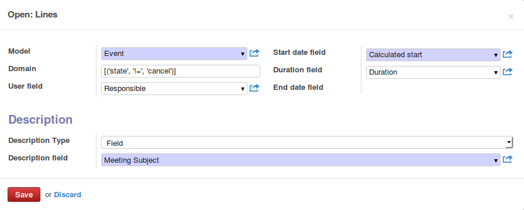
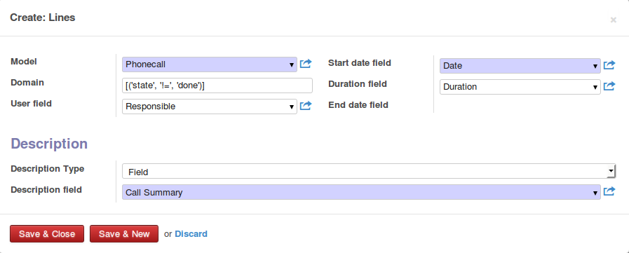
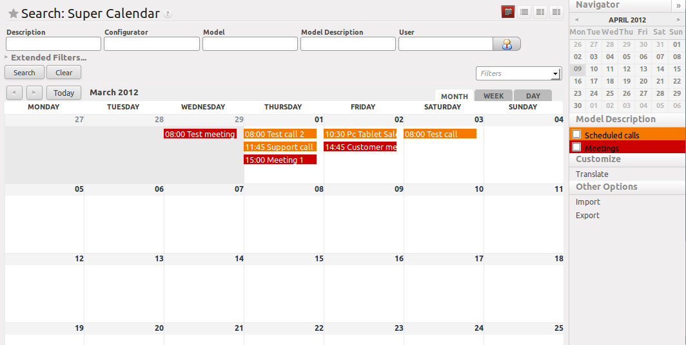
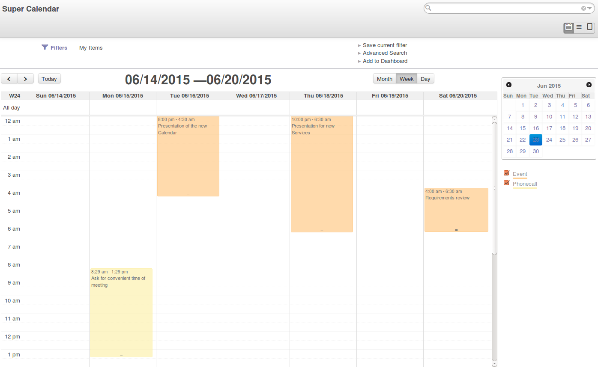

SUPER CALENDAR
==============

This module allows to create configurable calendars.

Through the 'calendar configurator' object, you can specify which models have
to be merged in the super calendar. For each model, you have to define the
'description' and 'date_start' fields at least. Then you can define 'duration'
and the 'user_id' fields.

The 'super.calendar' object contains the merged calendars. The
'super.calendar' can be updated by 'ir.cron' or manually.

Configuration
=============

After installing the module you can go to

*Super calendar > Configuration > Configurators*

and create a new configurator. For instance, if you want to see meetings and
phone calls, you can create the following lines

Meetings:

Phonecalls:

Then, you can use the 'Generate Calendar' button or wait for the scheduled
action (‘Generate Calendar Records’) to be run.

When the calendar is generated, you can visualize it by the 'super calendar' main menu.

Here is a sample monthly calendar:

And here is the weekly one:

As you can see, several filters are available. A typical usage consists in
filtering by 'Configurator' (if you have several configurators,
'Scheduled calls and meetings' can be one of them) and by your user.
Once you filtered, you can save the filter as 'Advanced filter' or even
add it to a dashboard.

Bug Tracker
===========

Bugs are tracked on `GitHub Issues <https://github.com/OCA/server-tools/issues>`_.
In case of trouble, please check there if your issue has already been reported.
If you spotted it first, help us smashing it by providing a detailed and welcomed feedback
`here <https://github.com/OCA/server-tools/issues/new?body=module:%20super_calendar%0Aversion:%208.0%0A%0A**Steps%20to%20reproduce**%0A-%20...%0A%0A**Current%20behavior**%0A%0A**Expected%20behavior**>`_.

Credits
=======

Contributors
------------
* Lorenzo Battistini <lorenzo.battistini@agilebg.com>
* Alejandro Santana <alejandrosantana@anubia.es>
* Agathe Mollé <agathe.molle@savoirfairelinux.com>

Maintainer
----------

.. image:: http://odoo-community.org/logo.png
   :alt: Odoo Community Association
   :target: http://odoo-community.org

This module is maintained by the OCA.

OCA, or the Odoo Community Association, is a nonprofit organization whose
mission is to support the collaborative development of Odoo features and
promote its widespread use.

To contribute to this module, please visit http://odoo-community.org.

Icon
----
Module icon from WebIconSet.com: http://www.webiconset.com/mobile-icon-set/
