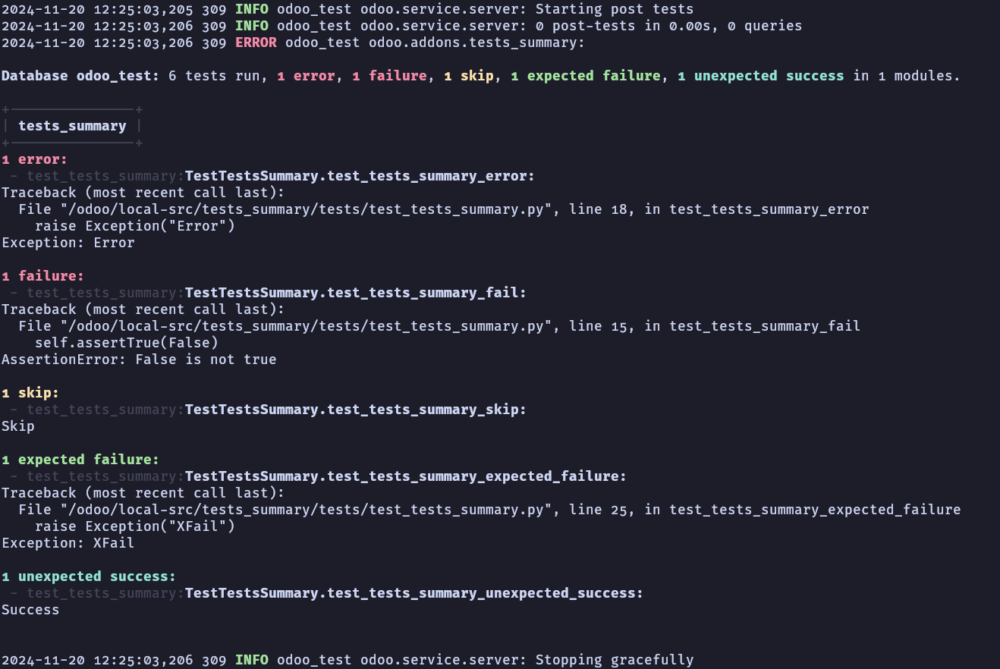

Add this module to your `server_wide_modules` list in your odoo.conf file to enable the
tests summary feature.

At the end of the tests, a summary will be displayed in the logs for quick review of the
test failures grouped by module.

The summary will look like this:

