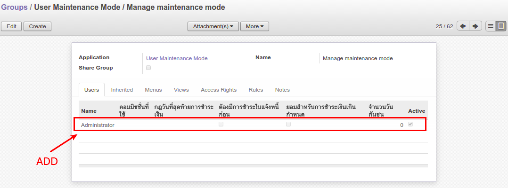

.. image:: https://img.shields.io/badge/licence-AGPL--3-blue.svg
   :target: http://www.gnu.org/licenses/agpl-3.0-standalone.html
   :alt: License: AGPL-3

=====================
User Maintenance Mode
=====================

Some companies need to use odoo server lock for some user to maintenance mode.
Which we have created group (manage maintenance mode) by system.

Users in this group can managed maintenance mode.

navigate setting (Settings > Users > Users)

Usage
=====

* Go to Settings > Users > Groups (Manage maintenance mode)

* Go to Settings > Users > Users (select the user you want and select change manage maintenance mode as shown below)

  * first

  .. figure:: static/description/change_maintenance_mode1.png
     :scale: 80 %
     :alt: Change manintenance mode button

  * second

  .. figure:: static/description/change_maintenance_mode2.png
     :scale: 80 %
     :alt: Change maintenance mode wizard

  * third

  .. figure:: static/description/change_maintenance_mode3.png
     :scale: 80 %
     :alt: Users are in maintenance mode

* The user will can't login again.

.. image:: https://odoo-community.org/website/image/ir.attachment/5784_f2813bd/datas
   :alt: Try me on Runbot
   :target: https://runbot.odoo-community.org/runbot/149/8.0

Bug Tracker
===========

Bugs are trackeะ้d on `GitHub Issues
<https://github.com/OCA/server-tools/issues>`_. In case of trouble, please
check there if your issue has already been reported. If you spotted it first,
help us smash it by providing detailed and welcomed feedback.

Credits
=======

Images
------

* Odoo Community Association: `Icon <https://github.com/OCA/maintainer-tools/blob/master/template/module/static/description/icon.svg>`_.

Contributors
------------

* Tharathip Chaweewongphan <tharathipc@ecosoft.co.th>

Maintainer
----------

.. image:: https://odoo-community.org/logo.png
   :alt: Odoo Community Association
   :target: https://odoo-community.org

This module is maintained by the OCA.

OCA, or the Odoo Community Association, is a nonprofit organization whose
mission is to support the collaborative development of Odoo features and
promote its widespread use.

To contribute to this module, please visit https://odoo-community.org.
